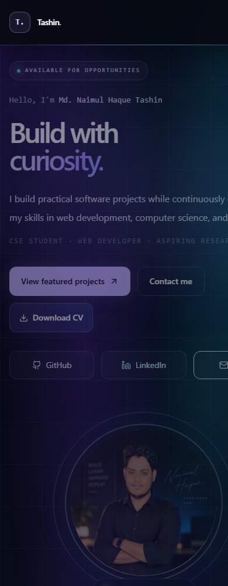

# Md. Naimul Haque Tashin | Portfolio

CSE Student, Web Developer, and Aspiring Researcher.

A personal portfolio showcasing practical software projects, a growing computer science foundation, and academic research interests. Built with Next.js and available as an installable Progressive Web App (PWA).

[Live Portfolio](https://naimulhaque.vercel.app) · [GitHub](https://github.com/Tashin90) · [LinkedIn](https://www.linkedin.com/in/md-naimul-haque-tashin-1a7917344/) · [Email](mailto:naimulhaque217@gmail.com)


[About Me](#about-me) · [Features](#features) · [Tech Stack](#tech-stack) · [Featured Projects](#featured-projects) · [PWA Features](#pwa-features) · [Local Installation](#local-installation) · [PWA Testing](#pwa-testing) · [Deployment](#deployment) · [Contact](#contact)

## About Me

I'm Md. Naimul Haque Tashin, a Computer Science & Engineering student at American International University-Bangladesh (AIUB), based in Dhaka, Bangladesh. I build practical software while developing my skills in web development, computer science, and research.

My work includes academic Java and C# applications, web technology projects, and C++ graphics exploration. My current learning focuses on advanced data structures and algorithms, JavaScript, C#, SQL, web development, machine learning, and research methodology.

### Skills and Learning

The following skills and learning areas are documented in [data/portfolio.ts](data/portfolio.ts):

| Area | Technologies and concepts |
| --- | --- |
| Programming languages | C#, C++, Java, JavaScript, SQL |
| Web development | HTML, CSS, JavaScript, React, Next.js, Tailwind CSS |
| Computer science | Data Structures, Algorithms, Object-Oriented Programming, Problem Solving |
| Databases | SQL Server, MySQL, SQLite |
| Tools and platforms | Git, GitHub, VS Code, Visual Studio |
| Currently exploring | Machine Learning, AI, REST APIs, Research |

### Achievements

- **Dean's Award for Academic Excellence** — American International University-Bangladesh (AIUB), 2026.
- **Certificate of Authorship: National Biomed Health ResearchCon (NBHRC) 2025** — Dhaka Medical College Research & Academic Club (DMC-RAC), August 2025.

### Research Interests

Software Engineering, Web Technologies, Machine Learning, Artificial Intelligence, Data Structures & Algorithms, and Academic Research. These reflect ongoing interests and learning, rather than claims of professional research experience.

## Features

- Responsive portfolio with a dark visual theme, gradient accents, and animated section reveals.
- Filterable project cards and a dedicated Gaming Store case study.
- Public GitHub repository activity with search and language/category filters, served through `/api/github`.
- Education and learning journey, skills, achievements, research interests, and current projects.
- Profile image, [downloadable CV](public/resume.pdf), and direct GitHub, LinkedIn, and email links.
- Installable PWA with an offline app shell and a dismissible install card.

<details>
<summary>View the existing mobile portfolio screenshot</summary>



Repository capture: [portfolio-mobile-qa.png](portfolio-mobile-qa.png).

</details>

## Tech Stack

| Layer | Implementation |
| --- | --- |
| Framework | Next.js 14, App Router |
| UI | React 18, TypeScript |
| Styling | Tailwind CSS 3, PostCSS, Autoprefixer |
| Motion and icons | Framer Motion, Lucide React |
| Repository data | GitHub REST API via a Next.js route handler |
| PWA | Web App Manifest, browser service worker, Cache Storage API |
| Deployment | Vercel with the standard Next.js preset |

Dependencies and available commands are defined in [package.json](package.json). Portfolio content is centralized in [data/portfolio.ts](data/portfolio.ts).

## Featured Projects

These are the five selected projects currently listed in the portfolio. Gaming Store is the primary featured project; the descriptions retain the academic and exploratory scope recorded in the project data.

| Project | Focus | Technologies |
| --- | --- | --- |
| [Gaming Store](https://github.com/Tashin90/Gaming-Store) | Academic gaming store application for practicing object-oriented programming. | Java, OOP |
| [StayFinder](https://github.com/Tashin90/StayFinder) | Software engineering project idea exploring a stay and rental management platform. | Software Engineering, Web Development |
| [Rental Management System](https://github.com/Tashin90/-RentalSystemUI) | Academic desktop application exploring property rental workflows. | C#, Windows Forms |
| [Web Technology Projects](https://github.com/Tashin90/Webtec-Summer2026) | Practical web work and learning experiments from the Summer 2026 track. | HTML, CSS, JavaScript |
| [Graphic](https://github.com/Tashin90/Graphic) | Academic exploration of graphics programming. | C++ |

## PWA Features

The portfolio can be installed from supported browsers and launched in its own standalone window.

| Setting | Value |
| --- | --- |
| App name | Md. Naimul Haque Tashin Portfolio |
| Short name | Tashin Portfolio |
| Manifest route | `/manifest.webmanifest` |
| Start URL and scope | `/` |
| Display | `standalone` |
| Orientation | `portrait-primary` |
| Theme / background | `#a78bfa` / `#060816` |
| Icons | 192×192 and 512×512 PNG/SVG icons; a 512px maskable PNG |
| Apple / favicon | 180×180 PNG Apple touch icon and 32×32 PNG favicon |

The manifest is generated by [app/manifest.ts](app/manifest.ts). Browser and Apple metadata are configured in [app/layout.tsx](app/layout.tsx), with icon assets in [public/icons](public/icons).

### Offline Behavior

[public/sw.js](public/sw.js) is served at `/sw.js` and registered by [components/PWAEnhancements.tsx](components/PWAEnhancements.tsx) in production. After an online visit and successful worker activation, it caches the homepage, its CSS/JS bundles, local icons, the profile image and its optimized variants, and the CV at `/resume.pdf`.

Page navigation and local assets try the network first and fall back to cached responses when the network fails. Next.js static bundles use cached responses first. GitHub API requests always use the network and are excluded from persistent service-worker caches. The existing [GitHub route handler](app/api/github/route.ts) separately revalidates its server-side data every hour. Offline GitHub requests show the portfolio's existing error state.

### Install on Android

1. Open the [Live Portfolio](https://naimulhaque.vercel.app) in Android Chrome over HTTPS.
2. When available, select **Install** on the portfolio's install card, or use Chrome's **Install app / Add to Home screen** menu.
3. Confirm installation and launch the portfolio from its app icon.

### Install on Desktop

Open the live portfolio in Chrome or Edge and use the address-bar install icon, the browser's app installation menu, or the portfolio's **Install** button when offered.

The install card appears only after the browser emits `beforeinstallprompt`, waits briefly before displaying, and opens the browser prompt only after a click. Dismissal lasts for the browser session; installation hides the card. Browsers without this event continue to display the normal website.

## Local Installation

Next.js 14 requires Node.js **18.17+**. The optional automated browser checks below require **Node.js 22+** for the built-in `WebSocket` API. npm and Git are also needed.

```bash
git clone https://github.com/Tashin90/My-Portfolio.git
cd My-Portfolio
npm ci
npm run dev
```

Open [http://localhost:3000](http://localhost:3000).

| Command | Purpose |
| --- | --- |
| `npm run dev` | Start the local development server |
| `npm run typecheck` | Run TypeScript checks without emitting files |
| `npm run build` | Create the production build |
| `npm start` | Serve the completed production build |

On Windows PowerShell, use `npm.cmd` in place of `npm` if script execution policy blocks `npm.ps1`.

## PWA Testing

Service-worker registration is enabled in production. Use the production server to test installation and caching; the development server avoids registering workers that would cache development bundles.

Stop any development server using port 3000, then run:

```bash
npm run typecheck
npm run build
npm start
```

### Manual Browser Checks

1. Open [http://localhost:3000](http://localhost:3000) in Chrome or Edge.
2. In **DevTools → Application → Manifest**, check the app names, colors, display, orientation, and icons against the settings above.
3. In **Application → Service Workers**, confirm `/sw.js` is registered, activated, and controlling the page.
4. After activation, switch to offline mode and reload. Confirm the page, styling, scripts, profile image, and CV remain available. GitHub data still requires a network connection.
5. Return online and check installation, dismissal, and disappearance of the card after installation. A browser decides when to offer installation; a missing card alone does not prove failure.

These routes should return HTTP 200 on the production server:

```text
/
/manifest.webmanifest
/sw.js
/icons/icon-192.svg
/icons/icon-512.svg
/icons/icon-192.png
/icons/icon-512.png
/icons/apple-touch-icon.png
/icons/favicon-32.png
/images/profile.png
/resume.pdf
```

### Automated Browser Checks

[scripts/verify-pwa.mjs](scripts/verify-pwa.mjs) uses the Chrome DevTools Protocol with no additional npm packages. Keep the production server running and launch a separate Chrome or Edge with these arguments, substituting a fresh temporary profile directory:

```text
--headless=new --remote-debugging-port=9222 --user-data-dir=<temporary-directory>
```

In a second terminal, run:

```bash
node scripts/verify-pwa.mjs
```

The script verifies routes and PNG dimensions, the manifest, Chromium installability, service-worker activation, offline reloads with HTTP caching disabled, profile/CV availability, exclusion of API data from caches, and install-card lifecycle behavior. Installation outcomes are simulated; the script does not install an app on the computer. The server must use port 3000. Set `PWA_DEBUG_URL` to use a debugging endpoint other than the default `http://localhost:9222`.

For icon maintenance, `node scripts/verify-pwa.mjs --generate-icons` uses the same browser setup to regenerate the 512px PNG, Apple touch icon, and favicon from the existing 512px SVG. It preserves the existing 192px PNG.

## Deployment

Deploy this repository with Vercel's standard Next.js integration:

1. Import **Tashin90/My-Portfolio** into Vercel.
2. Select the **Next.js** framework preset and the repository root.
3. Keep the standard output settings and use `npm run build`. Vercel can install dependencies from the committed npm lockfile.
4. Deploy and repeat the PWA checks on the production HTTPS URL.

The project uses Next.js route handlers and browser APIs with no custom server, static export, or special runtime configuration. The `/api/github` handler is part of the normal Next.js deployment.

[next.config.mjs](next.config.mjs) applies `no-cache, no-store, must-revalidate` to `/sw.js` and allows the worker to control `/`. Registration bypasses the HTTP cache when checking worker updates. The worker removes only outdated `tashin-portfolio-*` caches. Bump its `VERSION` when changing the precached asset set or caching behavior.

The live link above is the publicly reachable Vercel URL configured as this GitHub repository's homepage. No `.vercel` project configuration or `vercel.json` is committed in this repository.

## Contact

For opportunities, collaboration, or questions about my projects:

- **GitHub:** [github.com/Tashin90](https://github.com/Tashin90)
- **LinkedIn:** [Md. Naimul Haque Tashin](https://www.linkedin.com/in/md-naimul-haque-tashin-1a7917344/)
- **Email:** [naimulhaque217@gmail.com](mailto:naimulhaque217@gmail.com)
- **CV:** [Download resume.pdf](public/resume.pdf)

The website's contact form currently has no email-service backend. Please use the direct email link to send a message.
